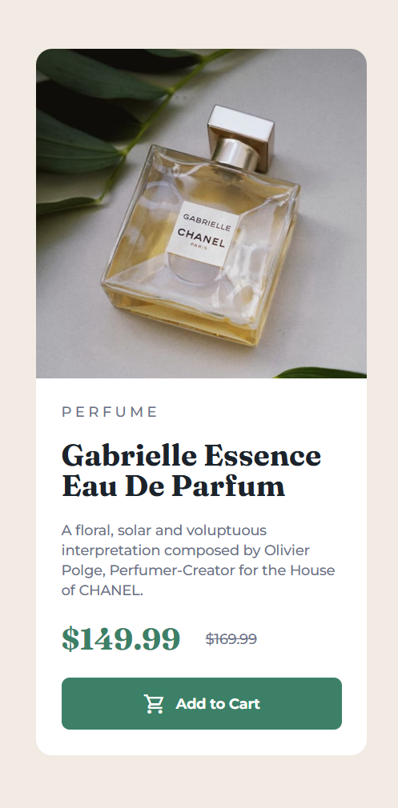

# 🛍️ Perfume Product Preview Card

Welcome to the **Perfume Product Preview Card** project! This elegant and responsive web component showcases *Gabrielle Essence Eau De Parfum* by CHANEL. Built with HTML and CSS, it features a refined design, sophisticated typography, and a mobile-friendly layout for an enhanced user experience.

---

## ✨ Features

- **Responsive Design** 📱💻: Seamlessly adapts to desktop and mobile screens using media queries.
- **Sleek Styling** 🎨: Incorporates HSL colors, premium fonts (*Montserrat* and *Fraunces*), and smooth border-radius effects.
- **Product Details** 🛒: Displays product type, title, description, pricing (with discount), and an interactive "Add to Cart" button.
- **Optimized Imagery** 🖼️: Switches between desktop and mobile images for the best visual presentation.

---

## 🛠️ Technologies Used

- **HTML5** 📝: Structures the product card layout.
- **CSS3** 🎨: Styled with Flexbox, media queries, and background images.
- **Fonts** ✍️: Google Fonts (*Montserrat* for body text, *Fraunces* for headings).
- **Colors** 🌈: HSL-based palette for a cohesive, modern look.

---

## 🚀 How to Run

1. **Clone or Download** the repository:
   ```bash
   git clone https://github.com/nisargvekariya01/Product_Card_Preview/tree/main
   ```
2. **Open `index.html`** in a web browser to view the product card.
3. **Ensure the images** are in the `images/` folder relative to `index.html`.
4. **Optional**: Use a local server (e.g., Live Server in VS Code) for a better development experience.

---

## 🌐 Live Demo

Check out the live demo of the Perfume Product Preview Card [here](https://example.com/perfume-preview-card)! Explore the responsive design and interactive elements in action.

---

## 🎨 Design Highlights

- **Card Layout** 🃏: Uses Flexbox for a side-by-side layout on desktop and a stacked layout on mobile.
- **Typography** ✍️:
  - *Montserrat* (500, 700 weights) for a clean, modern look.
  - *Fraunces* (700 weight) for bold, elegant headings.
- **Color Scheme** 🌈:
  - Background: `hsl(30, 38%, 92%)` (cream).
  - Primary text: `hsl(212, 21%, 14%)` (dark blue).
  - Accent: `hsl(158, 36%, 37%)` (dark cyan for price and button).
  - Secondary text: `hsl(228, 12%, 48%)` (grayish-blue).
- **Responsive Images** 🖼️: Switches between `image-product-desktop.jpg` and `image-product-mobile.jpg` based on screen size.

---

## 📱 Responsive Behavior

- **Desktop (>550px)**: Image and info sections are side-by-side, with rounded corners on the left (image) and right (card).
- **Mobile (≤550px)**: Stacks vertically, with the image at the top (full-width) and rounded corners adjusted for mobile.

---

## 🖼️ Screenshots

**Desktop View**: <br>


**Mobile View**: <br>


---

## 🌟 Inspiration

Inspired by modern e-commerce product cards, this project balances aesthetics and functionality, making it ideal for showcasing a single product with a focus on clean design and user engagement.

---

## 🙌 Contributing

Want to improve this project? You can:
- Submit a pull request with enhancements.
- Open an issue for bugs or feature suggestions.
- Add animations, hover effects, or new features to elevate the experience.

---

**Crafted with care by [Nisarg Vekariya](https://github.com/nisargvekariya01)**  
Happy coding! 🚀
